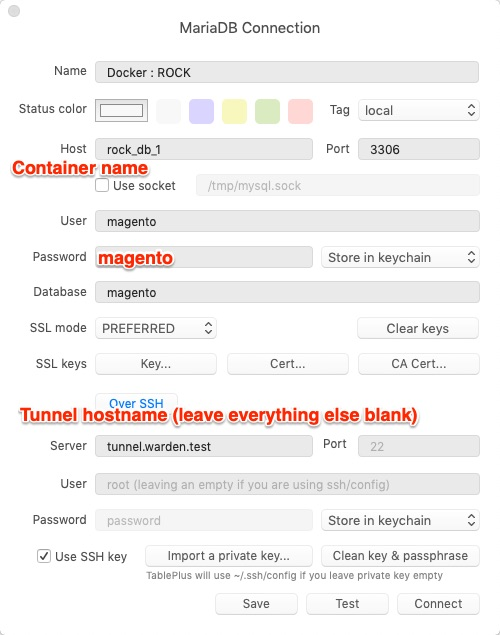
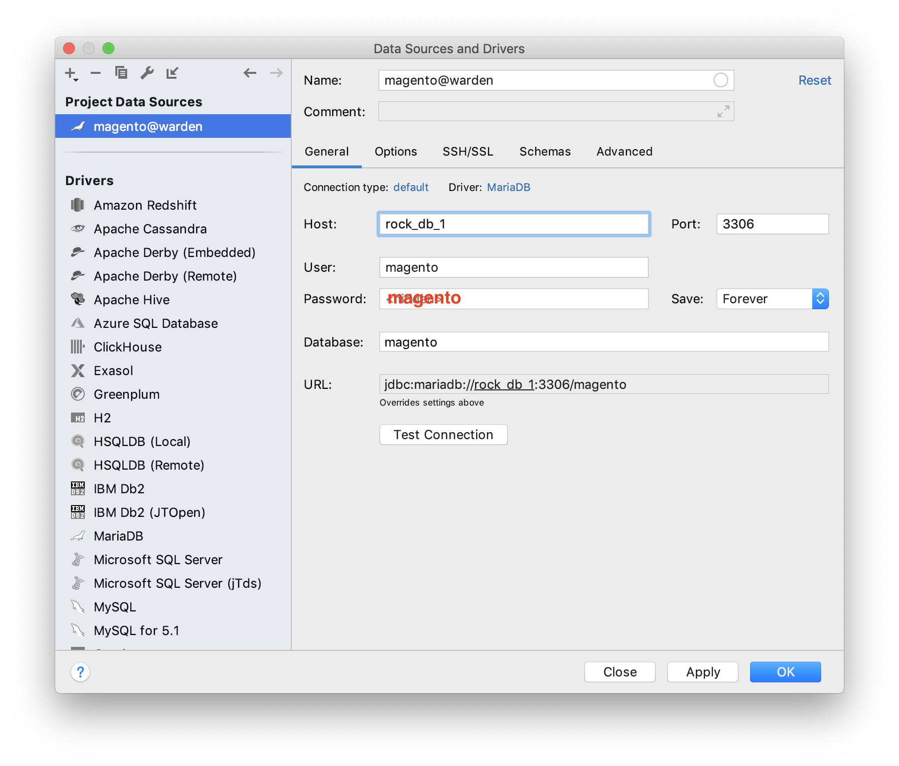
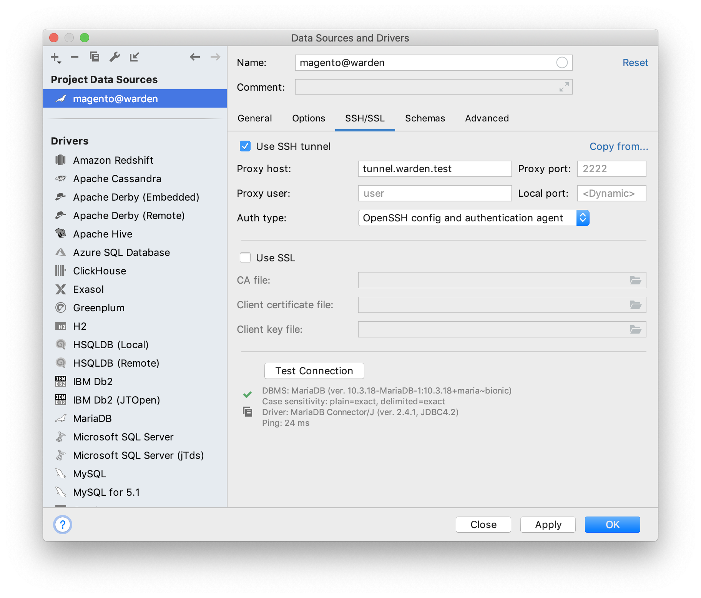
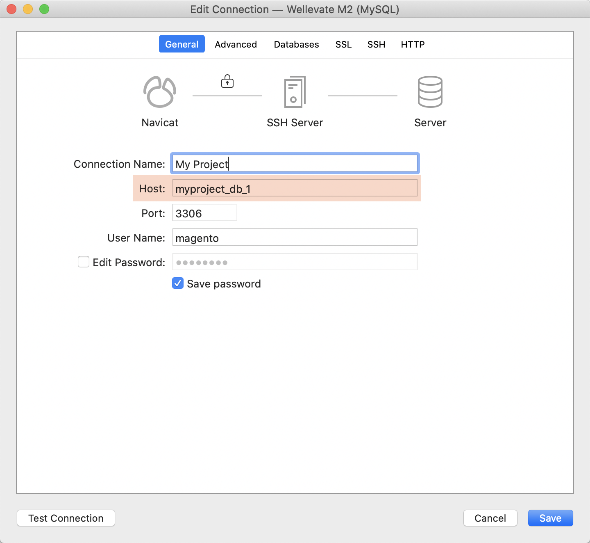
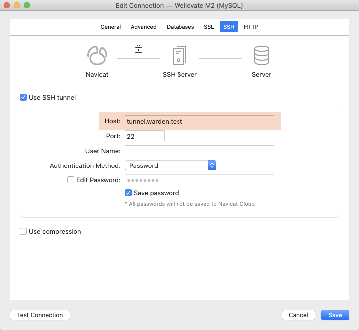

## Database Connections

### Common Settings

| Name                           | Value/Description                                                |
| ------------------------------ |----------------------------------------------------------------- |
| MySQL Host                     | Name of your Docker Container, can be found with `warden env ps` |
| MySQL Port                     | `3306`                                                           |
| MySQL User                     | `magento`                                                        |
| MySQL Password                 | `magento`                                                        |
| MySQL Database                 | `magento`                                                        |
| SSH Host, Proxy Host, Server   | `tunnel.warden.test`                                             |

### TablePlus

### Sequel Pro / Sequel Ace

### PhpStorm

### Navicat for MySQL

