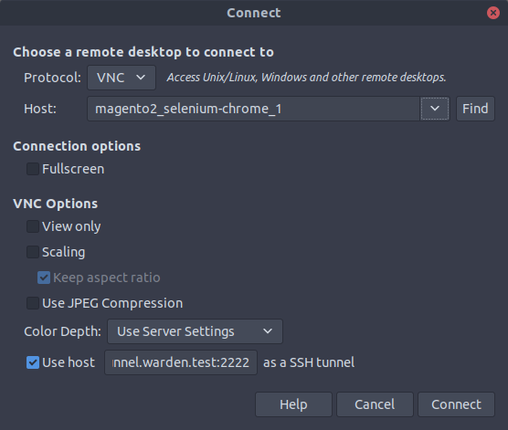
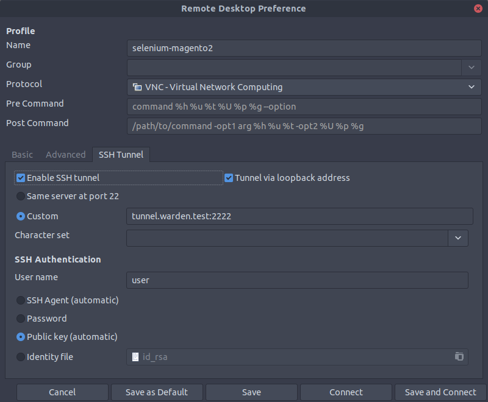

## Magento Functional Testing Framework

For information what **Magento Functional Testing Framework** is - please follow to [MFTF DevDocs](https://devdocs.magento.com/mftf/docs/introduction.html).

MFTF is part of Magento 2. To run tests you need [Selenium](https://selenium.dev/) instance with [Chrome Webdriver](https://sites.google.com/a/chromium.org/chromedriver/). Warden provides Docker setup that contains Selenium Standalone with Chrome. You can enable it by adding the following to the project's `.env` file (or exporting them to environment variables prior to starting the environment):

```
WARDEN_SELENIUM=1
```

After generating MFTF configuration files (`dev/tests/acceptance/.env` generated by `vendor/bin/mftf setup:env` command), you need to provide selenium hostname:

```
SELENIUM_HOST=selenium-hub
BROWSER=chrome
```

### Running Tests

We provide complex instruction on [How to run MFTF Tests](magento2-testing.html#running-mftf-tests) in Warden environment.

### Debugging MFTF Tests

By default Warden uses headless Chrome browser. If you want to preview the tests - you need to extend `.env` file and update environment containers (`warden env up -d`)

```
WARDEN_SELENIUM_DEBUG=1
```

**Default password for VNC session is `secret`**

To preview the process of testing, you need any **VLC** client that provides **SSH Tunnel** support (eg. [Remmina](https://remmina.org/how-to-install-remmina/)). To preview the process of testing, you need to use `tunnel.warden.test:2222` (login: `user`):

### Remote Desktop Viewer

  

### Remmina

  

### Mac OS X

To preview the process in Mac OS X, you must first create an SSH tunnel to the docker instance hosting the VNC server.  That would look something like:

    ssh -N -L localhost:5901:magento2_selenium-chrome_1:5900 tunnel.warden.test

Where `5901` is the port on your local computer you want to use to access the VNC server.  Then, using Finder you can "Go > Connect to Server" `vnc://localhost:5901`.

When you are prompted for the password it is `secret`.
