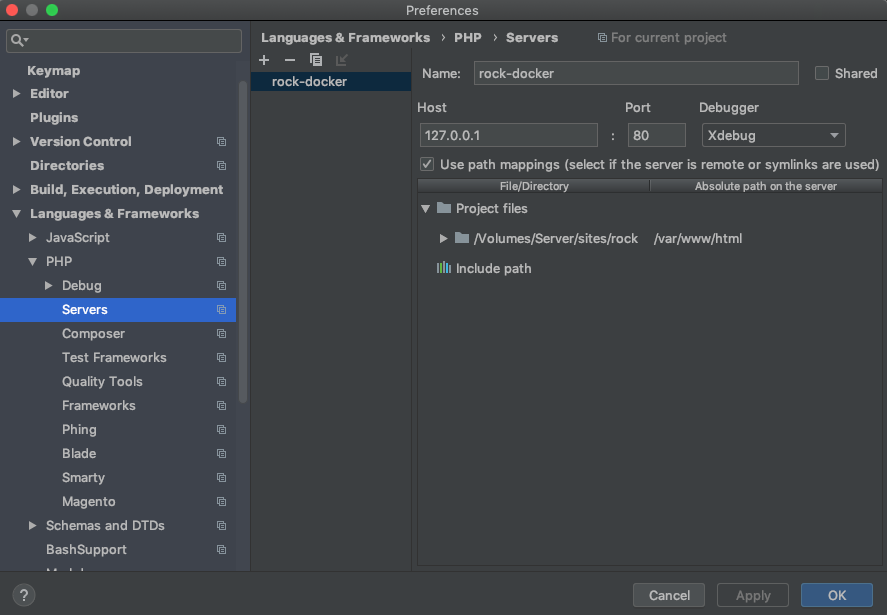
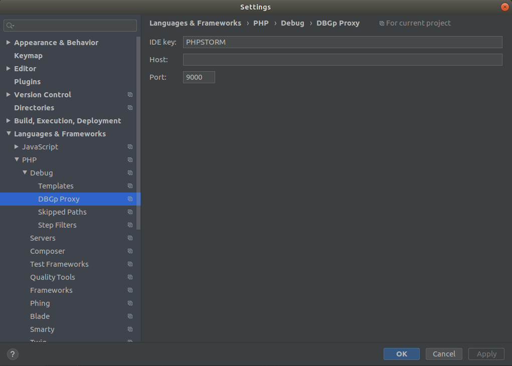

## Xdebug Support

There are two docker containers running FPM, `php-fpm`, `php-debug`. The `php-debug` container has the **Xdebug** extension pre-installed. Nginx will automatically route requests to the `php-debug` container when the `XDEBUG_SESSION` cookie has been set to `PHPSTORM` via the Xdebug Helper browser extension.

Xdebug will automatically connect back to the host machine on port `9000` for `xdebug2` and `9003` for `xdebug3` for each request routed to the `php-debug` container (i.e. when the `XDEBUG_SESSION` cookie is set). When configuring Xdebug Helper in your browser, make sure it is setting this cookie with the value `PHPSTORM`.

In similar fashion to the `warden shell` command there is also a debug command to launch into an xdebug enabled container shell for debugging CLI workflows:

```
warden debug
```

### VSCode

To configure a project in VSCode for debugging, add the following to `.vscode/launch.json` in the project directory:

```json
{
  "version": "0.2.0",
  "configurations": [
    {
      "name": "Listen for XDebug",
      "type": "php",
      "request": "launch",
      "port": 9003,
      "pathMappings": {
        "/var/www/html": "${workspaceRoot}"
      }
    }
  ]
}
```

``` note::
    If your project has (for example) ``WARDEN_WEB_ROOT=/webroot`` in it's ``.env`` file, to mount ``webroot/`` to ``/var/www/html`` rather than the top-level project directory, you may need to set the ``pathMapping`` above to ``${workspaceRoot}/webroot`` for the mapping to function correctly.
```

Once this configuration is in place, make sure you have the [PHP Debug extension by Felix Becker](https://marketplace.visualstudio.com/items?itemName=felixfbecker.php-debug) installed. This is required for Xdebug support to function in VSCode. Additional information on launch settings specific to Xdebug use in VSCode [may be found here](https://github.com/felixfbecker/vscode-php-debug#vs-code-configuration).

To learn more about debugging in VSCode, [please go here](https://code.visualstudio.com/docs/editor/debugging).

### PhpStorm

When it receives the first request, PHP Storm should prompt you if the "Server" configuration is missing. The below image demonstrates how this is setup; the important settings are these:

* Name: `clnt-docker` (this is the value of the `WARDEN_ENV_NAME` variable in the `.env` file appended with a `-docker` suffix)
* Host: `127.0.0.1`
* Port: `80`
* Debugger: Xdebug
* Use path mappings must be enabled, with a mapping to map the project root on the host to `/var/www/html` within the container.



Additional configurations may be required, such as configuring ``DBGp Proxy`` port.


